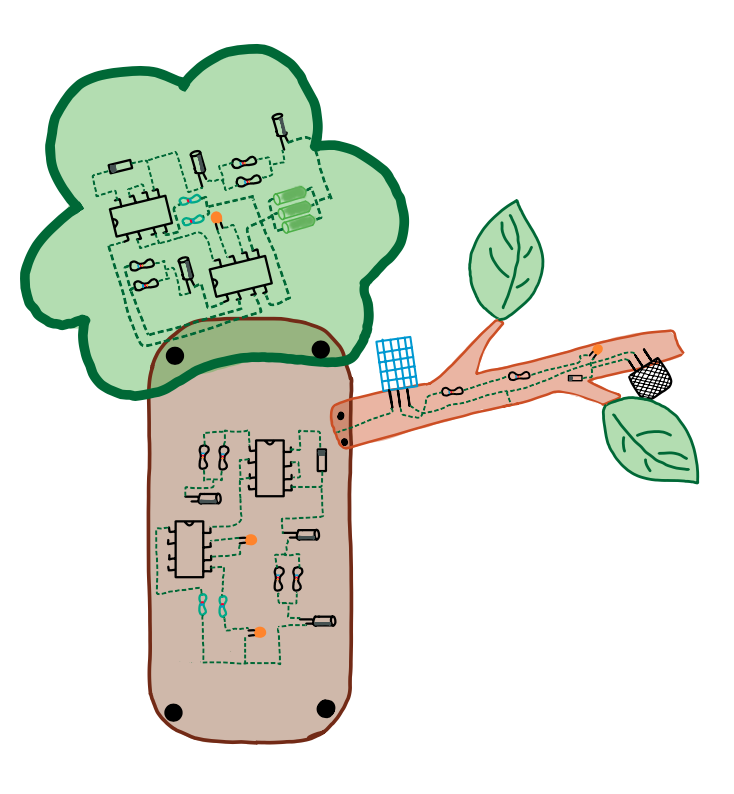
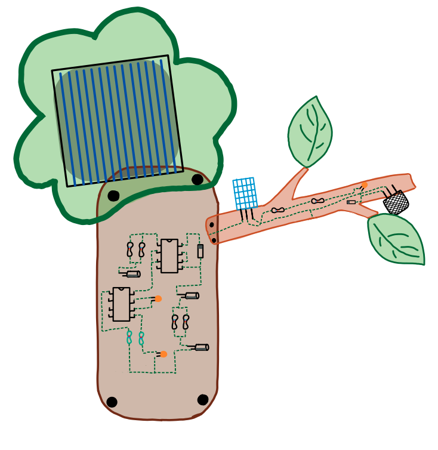

# Welcome to \<Interactive, Solar-Powered Air Quality Monitor with Adaptive Feedback\>!  
────────────────────────────────────────────
   
     🔥 Temperature & ~~~ CO2 →  🌳 Sensor Tree  →  🍃 Moving Leaves
               Detection           Solar System     Adaptive Feedback


```The project consists of a solar-powered, open-source air quality monitoring device built around a low-power microcontroller. It integrates environmental sensors for temperature, humidity, and air quality, combined with simple, tangible feedback mechanisms such as sound output and mechanical movement. This project serves as an educational and research-based learning resource developed within the context of a bachelor’s thesis in electrical engineering.```


## Vision and motivation
```The vision of this project is to lower the entry barriers to electrical engineering by providing an interactive, tangible learning artifact that connects theory and practice in an accessible way. Electrical engineering involves many complex and abstract concepts that can be difficult to approach, especially for students at an early stage of their studies or for technically interested non-experts. In strongly theory-driven learning contexts, practical relevance and interdisciplinary understanding are often missing or remain intangible. This project addresses these challenges by developing an interactive, solar-powered air quality monitor as a prototypical teaching and learning object. The device is designed not only as a functional technical system, but as a didactic artifact that makes core concepts of electrical engineering experientially understandable.```

## Hardware


```
Main Components
| Component                               | Function                                                           |
| --------------------------------------- | ------------------------------------------------------------------ |
| Arduino Pro Mini (5V)                   | Main microcontroller controlling sensors, servos, and audio module |
| BMP280 Sensor                           | Measures temperature and atmospheric pressure                      |
| SGP30 Sensor                            | Measures air quality (VOC and eCO₂ levels)                         |
| DFPlayer Mini                           | Audio playback module for environmental feedback sounds            |
| Mini Speaker (3W)                       | Audio output for DFPlayer                                          |
| 2× MG90S Servo Motors                   | Drive the mechanical leaf movement as physical feedback            |
| Solar Panel                             | Provides renewable power for the system                            |
| LiPo Battery(3,7V)                      | Energy storage for stable operation                                |
| Charging Module (TP4056 or similar)     | Battery charging and protection                                    |
| Voltage Regulation Module               | Ensures stable voltage supply for electronics                      |

Structural Components

| Component                           | Function                                             |
| ----------------------------------- | ---------------------------------------------------- |
| Laser-cut Acrylic Parts             | Structural frame and housing of the tree             |
| Threaded Brass Inserts / Screws     | Mechanical connections                               |
| Custom Acrylic Connectors           | Designed and laser cut to connect branches and trunk |
| Transparent Acrylic Crown           | Houses solar panel and diffuses light                |


```


## Quick Start / Documentation 

``` 
Software Setup
The prototype runs a simple Arduino-based program that reads environmental sensors and converts the data into mechanical and auditory feedback. The microcontroller controls the air-quality sensors, the servo motors that move the leaves, and the audio playback module.

How to run the code
1. Install the Arduino IDE.
2. Install the required libraries:
Adafruit BMP280 (temperature and pressure sensor)
Adafruit SGP30 (air quality sensor)
Servo library
DFRobotDFPlayerMini

3. Select the correct board (Arduino Pro Mini / ATmega328) in the Arduino IDE.
4. Connect the board using a USB-to-Serial adapter.
5. Upload the provided sketch from the /software folder.

Notes
The system reads air quality data (VOC / eCO₂) and maps it to servo movement and sound output.
Servo motors drive the leaf mechanism, providing physical feedback.
The DFPlayer Mini plays short environmental sound clips through a small speaker.
Power is provided through a solar panel and LiPo battery system.

```

## First conceptual sketch of the project




## Laser-cut acrylic components of the enclosure and mechanical elements




## Custom connection elements fabricated from acrylic




## Integration of mechanical components and electronic subsystems during assembly


## The completed prototype


## Links 

Website of Reallabor Wald: [lifolab.de](https://www.lifolab.de)

Fachgebiet Nachrichtenübertragung an der Technischen Universität Berlin: [tu.berlin/nue](https://www.tu.berlin/nue)

